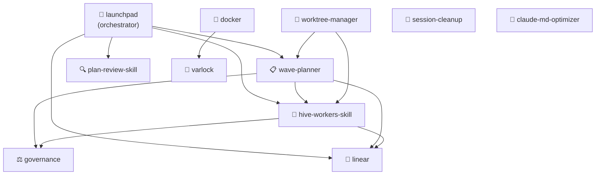

# Product Builder Starter Pack

**11 Claude Code skills for product builders shipping with AI**

A curated collection of Claude Code skills for product builders and first-time agentic engineers. Install these skills to go from a blank Claude Code session to a full planning-to-execution workflow in minutes.

---

## Who It's For

You're a product builder who has started using Claude Code. You can see the power, but getting from "chat with an AI" to "ship production features with an AI agent" requires knowing which skills to install and in what order. This starter pack gives you that foundation:

- You have Claude Code installed and a project you're working on
- You use **Linear** for issue tracking
- You want to use Claude for planning, code reviews, and executing work across your team
- You want secrets handled safely from day one

---

## Quick Install

Each skill is a directory you copy into `~/.claude/skills/`. Clone this repo, then copy:

```bash
# Clone the starter pack
git clone https://github.com/smith-horn/pm-agentic-starter.git ~/pm-agentic-starter

# Install all 11 skills at once
cp -r ~/pm-agentic-starter/skills/governance ~/.claude/skills/
cp -r ~/pm-agentic-starter/skills/plan-review-skill ~/.claude/skills/
cp -r ~/pm-agentic-starter/skills/launchpad ~/.claude/skills/
cp -r ~/pm-agentic-starter/skills/wave-planner ~/.claude/skills/
cp -r ~/pm-agentic-starter/skills/hive-workers-skill ~/.claude/skills/
cp -r ~/pm-agentic-starter/skills/worktree-manager ~/.claude/skills/
cp -r ~/pm-agentic-starter/skills/linear ~/.claude/skills/
cp -r ~/pm-agentic-starter/skills/varlock ~/.claude/skills/
cp -r ~/pm-agentic-starter/skills/docker ~/.claude/skills/
cp -r ~/pm-agentic-starter/skills/session-cleanup ~/.claude/skills/
cp -r ~/pm-agentic-starter/skills/claude-md-optimizer ~/.claude/skills/
```

Or install individual skills:

```bash
# Linear only
cp -r ~/pm-agentic-starter/skills/linear ~/.claude/skills/

# Docker only
cp -r ~/pm-agentic-starter/skills/docker ~/.claude/skills/
```

After copying, skills activate automatically based on trigger phrases in your next Claude Code session.

### First-Time CLAUDE.md Setup

After installing skills, add this block to your project's `CLAUDE.md`. It tells Claude to use the optimizer before your file grows past the context limit — a common gotcha on active projects.

```markdown
## Context Management

When this file approaches 200 lines or Claude reports context pressure, run:

/claude-md-optimizer

This extracts verbose sections into sub-docs under `.claude/` and replaces them
with concise summaries + links, keeping CLAUDE.md under the 200-line limit.
```

Run it the first time right now if your CLAUDE.md is already long:

```
/claude-md-optimizer
```

Claude will audit the file, extract sections that exceed their purpose, and link out to sub-docs — recovering your context window without losing any instructions.

---

## Skills

| Skill | Version | What it does | Trigger phrase | Install |
|-------|---------|-------------|----------------|---------|
| **linear** | 2.2.3 | Create, update, and query Linear issues; bulk syncs; project lifecycle management | "create issue", "update Linear", "sync to Linear" | `cp -r skills/linear ~/.claude/skills/` |
| **governance** | 1.4.0 | Code reviews, retrospectives, standards enforcement; zero-deferral policy (fixes everything now) | "/review", "code review", "run a retro", "/retro" | `cp -r skills/governance ~/.claude/skills/` |
| **launchpad** | 1.2.0 | End-to-end orchestrator: chains wave-planner → plan-review → linear → execution in one workflow | "/launchpad", "plan and execute", "run the initiative" | `cp -r skills/launchpad ~/.claude/skills/` |
| **wave-planner** | 2.0.0 | Break Linear issues into execution-ready waves with risk ordering, agent assignments, and TDD workflow | "/wave-planner", "/plan", "break this down into waves" | `cp -r skills/wave-planner ~/.claude/skills/` |
| **plan-review-skill** | 2.0.0 | VP Product + VP Engineering + VP Design review any plan; surfaces blockers before you write a line | "/plan-review-skill", "review this plan", "VP review" | `cp -r skills/plan-review-skill ~/.claude/skills/` |
| **varlock** | 1.0.0 | Secure secret management — never expose API keys in terminal output or Claude's context | "environment variables", "secrets", ".env", "API key" | `cp -r skills/varlock ~/.claude/skills/` |
| **docker** | 1.1.0 | Docker-first development enforcement; all npm/node commands run in containers | "npm install", "run the build", "start the server" | `cp -r skills/docker ~/.claude/skills/` |
| **claude-md-optimizer** | 1.1.1 | Shrink oversized CLAUDE.md files using progressive disclosure (extracts to sub-docs) | "optimize CLAUDE.md", "CLAUDE.md too long", "reduce CLAUDE.md size" | `cp -r skills/claude-md-optimizer ~/.claude/skills/` |
| **hive-workers-skill** | 1.0.0 | Execute tasks and epics with parallel hive mind agents; automatic code review, governance gate, sprint report | "/hive-workers", "execute with hive mind", "orchestrate these tasks" | `cp -r skills/hive-workers-skill ~/.claude/skills/` |
| **worktree-manager** | 2.0.0 | Parallel feature branches via git worktrees; wave-aware conflict prevention | "/worktree", "create worktree", "parallel development" | `cp -r skills/worktree-manager ~/.claude/skills/` |
| **session-cleanup** | 1.2.0 | End-of-session housekeeping: branch audit, worktree removal, main sync | "/session-cleanup", "clean up branches", "end of session" | `cp -r skills/session-cleanup ~/.claude/skills/` |

---

## Skill Dependency Graph

Install order matters — upstream skills are required for downstream orchestration to work.



---

## Usage Ranking

Skills ranked by workflow centrality — start from the top when getting started.

> **Note**: Ranking is based on skill composition fan-in, installation sequence, and PM workflow position — not live telemetry.

| Rank | Skill | Basis |
|------|-------|-------|
| 1 | **linear** | Core PM tool; composed by governance, launchpad, wave-planner, hive-workers-skill — highest fan-in |
| 2 | **governance** | Foundational; composed by launchpad, wave-planner, hive-workers-skill; runs on every code review |
| 3 | **launchpad** | Orchestrates 6 skills; highest fan-out; entry point for most initiatives |
| 4 | **wave-planner** | Composes linear + governance; used for every feature sprint |
| 5 | **hive-workers-skill** | Execution engine; composes governance + linear; runs every wave implementation |
| 6 | **plan-review-skill** | Stage gate between planning and execution; composes into launchpad |
| 7 | **varlock** | Security prerequisite; integrated into linear and docker skill docs |
| 8 | **docker** | Dev environment baseline; lower PM touch frequency |
| 9 | **claude-md-optimizer** | Setup/maintenance; used when CLAUDE.md grows beyond context limits |
| 10 | **worktree-manager** | Advanced parallelism; composes wave-planner + hive-workers-skill |
| 11 | **session-cleanup** | End-of-session only; lowest trigger frequency |

---

## Prerequisites

### 1. Claude Code

Install Claude Code and configure it for your project. Add your project's CLAUDE.md with Docker commands, test patterns, and project structure.

### 2. Linear MCP (for `linear` skill)

The linear skill requires the Linear MCP server. Run this command in your terminal:

```bash
claude mcp add --transport http linear-server https://mcp.linear.app/mcp
```

Then open a Claude Code session and run `/mcp` to complete authentication with your Linear account.

> See the [Linear MCP docs](https://linear.app/docs/mcp) for the latest setup instructions.

### 3. Varlock (for `varlock` skill)

```bash
curl -sSfL https://varlock.dev/install.sh | sh -s -- --force-no-brew
export PATH="$HOME/.varlock/bin:$PATH"
```

### 4. Docker (for `docker` and `worktree-manager` skills)

Docker Desktop or OrbStack. The docker skill enforces all npm/node operations run inside containers — keeps your host machine clean and ensures consistent environments.

### 5. Claude-Flow MCP (for `hive-workers-skill`)

```bash
claude mcp add claude-flow -- npx claude-flow@alpha mcp start
```

Required for multi-agent hive mind orchestration. The hive-workers-skill uses `mcp__claude-flow__*` tools to spawn and coordinate parallel agents.

---

## Advanced Dependencies

The following skills are required for **full launchpad functionality** but are not bundled here (they are encrypted project-level skills in the Skillsmith codebase):

| Skill | Used In | What it does | Install |
|-------|---------|-------------|---------|
| `sparc-methodology` | launchpad Stage 1a (infra route) | SPARC researcher + architect for infrastructure changes; writes implementation plan to `docs/internal/implementation/` | [Skillsmith Registry](https://skillsmith.app) |

> Without `sparc-methodology`, launchpad falls back gracefully: Stage 1a routes to wave-planner for all changes.

---

## Optional Community Extensions

These community skills extend the `docker` skill with automated enforcement and optimization:

| Skill | Author | What it adds | Install |
|-------|--------|-------------|---------|
| `docker-enforce` | wrsmith108 | Intercepts and blocks host-machine npm/node commands; auto-transforms to `docker exec` | `git clone https://github.com/wrsmith108/docker-enforce.git ~/.claude/skills/docker-enforce` |
| `docker-optimizer` | wrsmith108 | Analyzes Dockerfiles for size and layer optimization opportunities | Available via Skillsmith registry |

---

## Typical PM Workflow

Once all skills are installed, a typical sprint looks like this:

```
1. Start initiative
   → /launchpad "SMI-1234, SMI-1235, SMI-1236"
   → Wave planner breaks issues into waves
   → Plan review surfaces blockers (VP Product, Engineering, Design)
   → Linear project + issues created

2. During development
   → /hive-workers to execute a wave with parallel agents
   → /review before every merge
   → governance fixes everything it finds, no tickets
   → /wave-planner if you need to re-plan mid-sprint

3. Deploy day
   → docker skill ensures containers are healthy
   → varlock validates all secrets before deploys

4. End of session
   → /session-cleanup
   → branches audited, worktrees removed, main synced

5. CLAUDE.md growing?
   → /claude-md-optimizer
   → sub-docs extracted, context window recovered
```

---

## Contributing

Found a skill that would help PMs ship with Claude? Open a [skill request](.github/ISSUE_TEMPLATE/skill-request.md) or submit a PR.

Skills in this pack follow the [Skillsmith skill format](https://skillsmith.app/docs/skill-format):
- `SKILL.md` with YAML frontmatter (name, version, description, triggers)
- `agent-prompt.md` for complex skills using the thin-dispatcher pattern
- Sub-docs for progressive disclosure (keeps SKILL.md under 200 lines)

---

## License

MIT — see [LICENSE](LICENSE).

Individual skills retain their original authorship (see `author:` field in each `SKILL.md`).

---

*Part of the [Smith Horn](https://github.com/smith-horn) toolchain for agentic engineering.*
